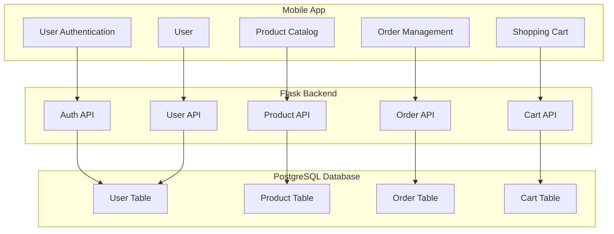

# Info

This is KMP MarketPlace backend app.

# PaaS

## Used services

[Supabase](https://supabase.com/dashboard/project/ulwhvgtkewyxpcubqfjq) PostgreSQL.

# Graph

```mermaid
graph TD;
    subgraph Mobile App
        Auth[User Authentication];
        Catalog[Product Catalog];
        Cart[Shopping Cart];
        Order[Order Management];
        User[User];
    end

    subgraph Flask Backend
        AuthAPI[Auth API];
        ProductAPI[Product API];
        CartAPI[Cart API];
        OrderAPI[Order API];
        UserAPI[User API];
    end

    subgraph PostgreSQL Database
        UserTable[User Table];
        ProductTable[Product Table];
        OrderTable[Order Table];
        CartTable[Cart Table];
    end

    Auth --> AuthAPI
    Catalog --> ProductAPI
    Cart --> CartAPI
    Order --> OrderAPI
    User --> UserAPI

    AuthAPI --> UserTable
    ProductAPI --> ProductTable
    CartAPI --> CartTable
    OrderAPI --> OrderTable
    UserAPI --> UserTable
```