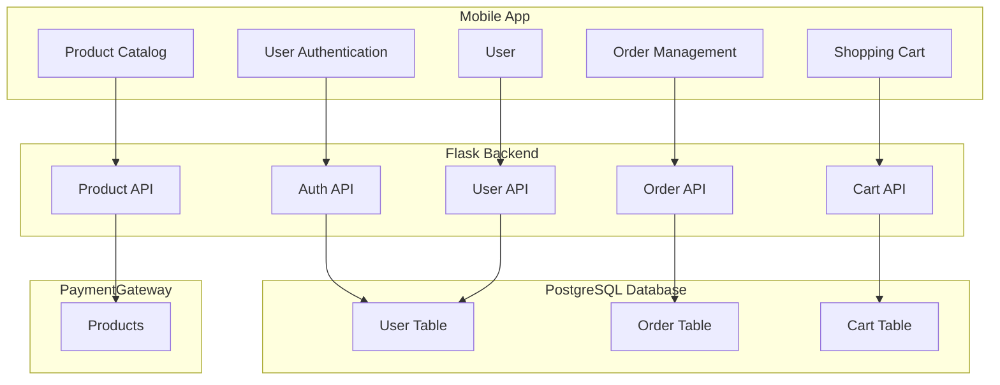

# Info

This is KMP MarketPlace backend app.

# Run

To run application in a Docker container:

1. Install Docker on your system.

2. Build the Docker image:

    ```bash
    docker build -t my-app .
    ```

3. Run the Docker container with hot reload enabled:

    ```bash
    docker run -d -p 5000:5000 -v $(pwd):/app my-app
    ```

4. Access the application at `http://localhost:5000`.

# PaaS

## Used services

[Supabase](https://supabase.com/dashboard/project/ulwhvgtkewyxpcubqfjq) PostgreSQL.

# Graph

