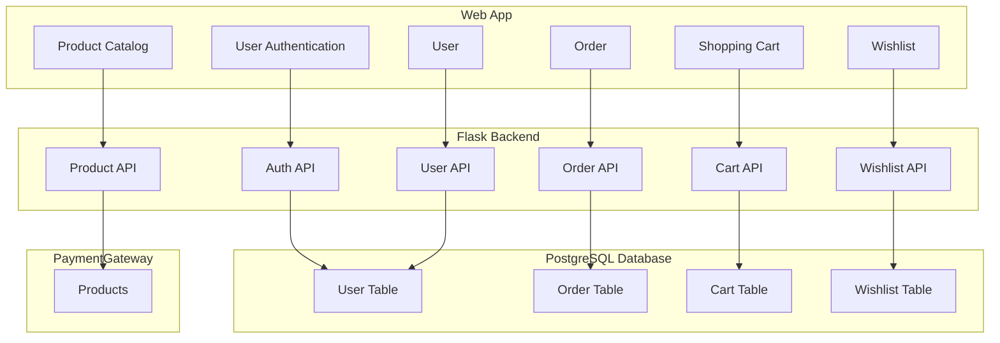

# Info

This is MarketPlace backend app.

# Run

## Locally

1. Set environmental variables:

   ```bash
   export FLASK_ENV=development # or production
   export FLASK_DEBUG=1
   ```

2. Add `.env.development` or `.env.production` file to the project root directory.

3. Install dependencies

   ```bash
   pip install -r requirements.txt
   ```

4. Run app:

   ```bash 
   flask run
   ```

5. Forward Stripe events:

   ```bash
   stripe listen --forward-to http://localhost:5000/webhook/order/paid
   ```

## Docker

To run application in a Docker container:

1. Install Docker on your system.

2. Build the Docker image:

    ```bash
    docker build -t my-app .
    ```

3. Run the Docker container with hot reload enabled:

    ```bash
    docker run -d -p 5000:5000 -v $(pwd):/app my-app
    ```

4. Access the application at `http://localhost:5000`.

# Database

PostgreSQL is used as the database for this project.

## PostgreSQL migration

Alembic is used for database migration. Follow these steps to manage migrations:

1. Create migration file:
   ```bash
   alembic revision --autogenerate -m <message>
   ```
2. Review and update the migration script if necessary. The script can be found in the alembic/versions directory.
3. Apply the migration:
   ```bash
   alembic upgrade head
   ```

##### Note

Considering we have both production and development environment setups, migration has to be done twice, once for each
environment. To switch between environments, use:

   ```bash
   export FLASK_ENV=development # or production
   ```

Make sure to set the appropriate environment variables in your `.env.development` and `.env.production` files.

# Payment Gateway

Stripe is used as a payment gateway. Some of the docs used during development:

- [Stripe API](https://docs.stripe.com/api)
- [Stripe CLI](https://docs.stripe.com/stripe-apps/reference/cli)
- [Webhooks](https://docs.stripe.com/webhooks)

# Graph

